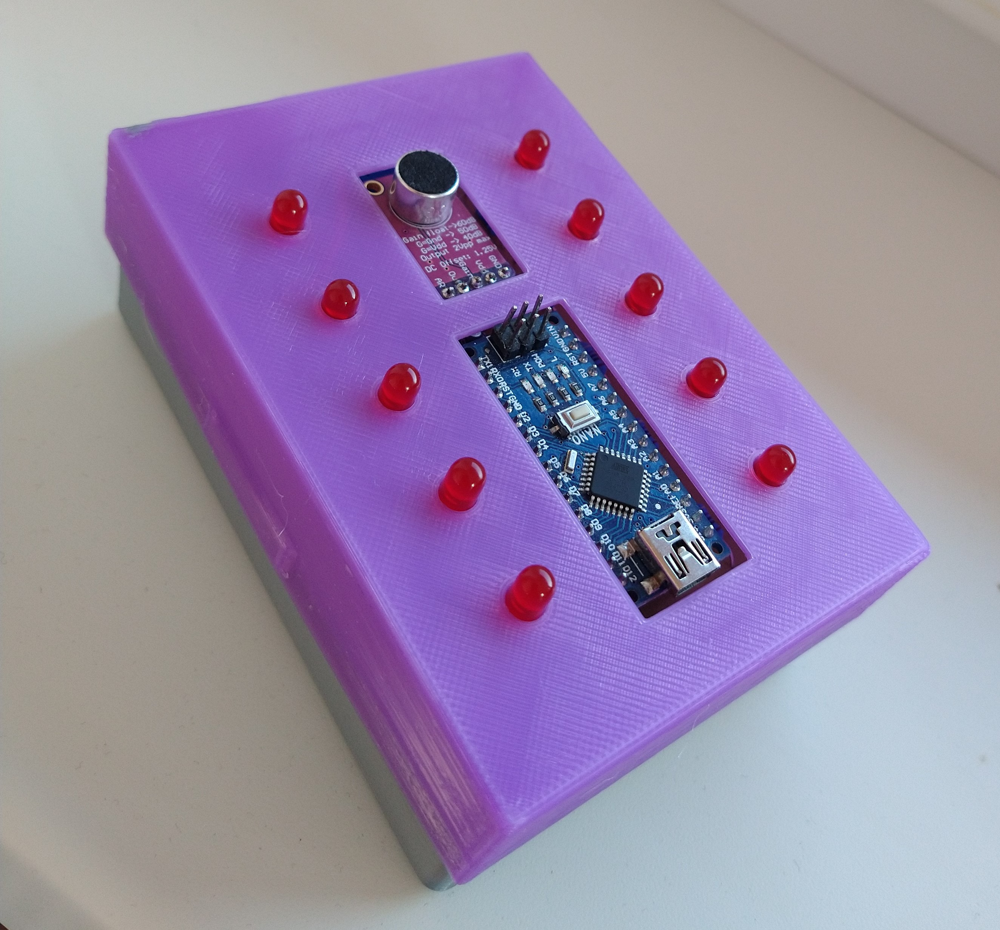

# Arduino speech commands recognition
Arduino speech commands recognition is project in which I tried teach Arduino Nano recognizing words or commands using neural network. This project is inspirated by another [speech commands recognition project by Peter Balch](https://www.instructables.com/Speech-Recognition-With-an-Arduino-Nano/).
Difference between mine and Balch's project is that I used different algorithm for recognizing words.

